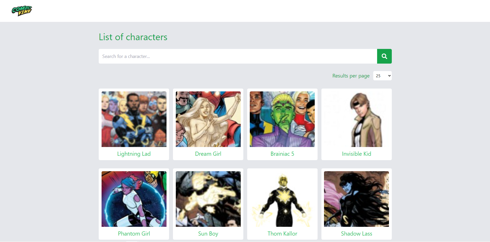
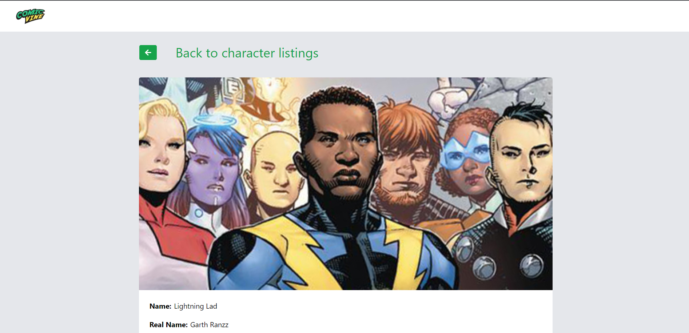

# 📙 Sobre o projeto
Aplicação atende a todas as pessoas que desejam conhecer mais o mundo dos quadrinhos, sendo possivel acompanhar de perto todos os personagens e suas respectivas histórias utilizando a base de dados da Comic Vine que é o maior banco de dados de quadrinhos on-line, que também apresenta análises de quadrinhos, notícias, vídeos e fóruns para as últimas novidades relacionadas a quadrinhos.

# 🏃 Começando
## 📝 Requisitos
* npm
  ```sh
  npm install npm@latest -g
  ```
## ⚙️ Instalação
1. Criar uma conta em https://comicvine.gamespot.com
2. Pegar sua chave da API aqui: https://comicvine.gamespot.com/api
3. Clonar o repositório
```sh
    git clone git@github.com:silva4dev/ts-next-idinheiro-challenges.git
```
4. Instalar as dependências
```sh
   npm install
```
5. Duplique o arquivo .env.example na raiz do projeto
6. Renomei o arquivo .env.example para .env
7. Adicione a chave da API no arquivo .env

# 📺 Telas


